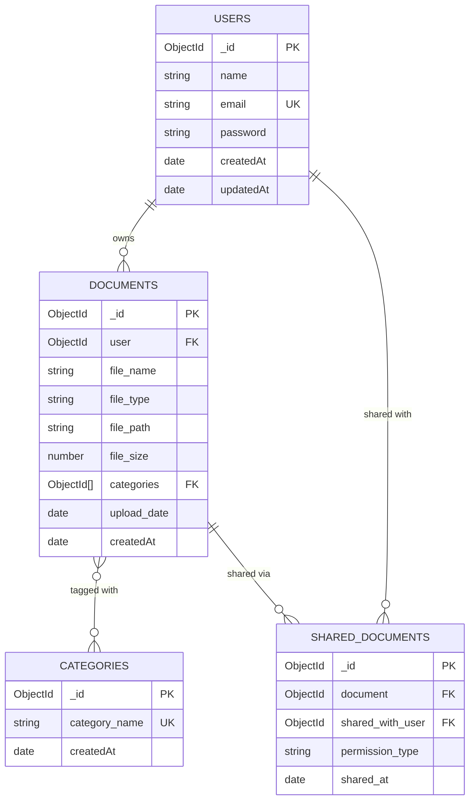

# DigiLocker NoSQL (MongoDB) Database Architecture & Schema Documentation

## 1. Overview & Capstone Transformation Summary

This project transformed the **DigiLocker** secure digital storage system from a traditional relational database (**MySQL**) to a scalable document-oriented database (**MongoDB / NoSQL**) using **Mongoose ODM**.

---

## 2. Relational (MySQL) vs. NoSQL (MongoDB) Architecture Mapping



### Key Differences & Architectural Advantages

| Feature | Relational MySQL (Previous) | NoSQL MongoDB (Transformed) |
| :--- | :--- | :--- |
| **Data Format** | Rigid tabular format with fixed column definitions. | Flexible BSON/JSON documents with rich nested structures and arrays. |
| **Many-to-Many Linking** | Required a junction table `Document_Category (document_id, category_id)`. | Embedded array of ObjectIds (`categories: [ObjectId]`) directly in the document schema. |
| **Indexing** | B-Tree indices on relational columns. | High-performance compound & unique indices on `email`, `user`, and `shared_with_user`. |
| **Scalability** | Vertical scaling (compute/storage upgrade per node). | Built-in horizontal sharding and replica set clustering. |
| **Cascading Deletes** | Database-level `ON DELETE CASCADE`. | ODM middleware / controller-level cascading cleanup removing orphaned shares. |

---

## 3. MongoDB Document Schemas

### 3.1 Users Collection (`users`)
```json
{
  "_id": "6ab299d7f3e11dbb0d465923",
  "name": "Ravi Kumar",
  "email": "ravi@example.com",
  "password": "$2b$10$hashedPasswordString...",
  "createdAt": "2026-09-22T15:08:07.305Z",
  "updatedAt": "2026-09-22T15:08:07.305Z"
}
```
**Indexes**:
- Unique index on `email` (lowercased)

---

### 3.2 Categories Collection (`categories`)
```json
{
  "_id": "6ab299d7f3e11dbb0d465921",
  "category_name": "Aadhar Card",
  "createdAt": "2026-09-22T15:08:00.000Z",
  "updatedAt": "2026-09-22T15:08:00.000Z"
}
```
**Indexes**:
- Unique index on `category_name`

---

### 3.3 Documents Collection (`documents`)
```json
{
  "_id": "6ab299d7f3e11dbb0d465925",
  "user": "6ab299d7f3e11dbb0d465923",
  "file_name": "Ravi_Aadhar_Card.pdf",
  "file_type": "application/pdf",
  "file_path": "uploads/document-1790089687300.pdf",
  "file_size": 1024000,
  "categories": [
    "6ab299d7f3e11dbb0d465921"
  ],
  "upload_date": "2026-09-22T15:08:07.305Z",
  "createdAt": "2026-09-22T15:08:07.305Z",
  "updatedAt": "2026-09-22T15:08:07.305Z"
}
```
**Indexes**:
- Index on `user` (owner retrieval)
- Index on `file_name` (search performance)

---

### 3.4 Shared Documents Collection (`shareddocuments`)
```json
{
  "_id": "6ab299d71f5829189b6a2f64",
  "document": "6ab299d7f3e11dbb0d465925",
  "shared_with_user": "6ab299d7f3e11dbb0d465924",
  "permission_type": "DOWNLOAD",
  "shared_at": "2026-09-22T15:08:07.310Z",
  "createdAt": "2026-09-22T15:08:07.310Z",
  "updatedAt": "2026-09-22T15:08:07.310Z"
}
```
**Indexes**:
- Compound/Foreign Key index on `shared_with_user` and `document`

---

## 4. NoSQL CRUD Operations Reference (SQL vs MongoDB)

### 1. Create Operations (Insert)
* **MySQL**:
  ```sql
  INSERT INTO Documents (user_id, file_name, file_type, file_path, file_size) 
  VALUES (1, 'Aadhar.pdf', 'application/pdf', 'uploads/doc.pdf', 1024000);
  ```
* **MongoDB (Mongoose)**:
  ```javascript
  const doc = await Document.create({
      user: userId,
      file_name: 'Aadhar.pdf',
      file_type: 'application/pdf',
      file_path: 'uploads/doc.pdf',
      file_size: 1024000,
      categories: [categoryId]
  });
  ```

---

### 2. Read Operations (Query & Populate)
* **MySQL** (Join query):
  ```sql
  SELECT d.file_name, c.category_name 
  FROM Documents d 
  JOIN Document_Category dc ON d.id = dc.document_id 
  JOIN Categories c ON dc.category_id = c.id 
  WHERE d.user_id = 1;
  ```
* **MongoDB (Mongoose)**:
  ```javascript
  const documents = await Document.find({ user: userId })
      .populate('categories', 'category_name')
      .sort({ createdAt: -1 });
  ```

---

### 3. Shared Documents Query
* **MySQL**:
  ```sql
  SELECT sd.id, d.file_name, u.name AS owner_name, sd.permission_type 
  FROM Shared_Documents sd 
  JOIN Documents d ON sd.document_id = d.id 
  JOIN Users u ON d.user_id = u.id 
  WHERE sd.shared_with_user_id = 2;
  ```
* **MongoDB (Mongoose)**:
  ```javascript
  const sharedDocs = await SharedDocument.find({ shared_with_user: userId })
      .populate({
          path: 'document',
          populate: { path: 'user', select: 'name email' }
      });
  ```

---

### 4. Delete & Cascade Operations
* **MySQL**:
  ```sql
  DELETE FROM Documents WHERE id = 1; -- Triggered ON DELETE CASCADE
  ```
* **MongoDB**:
  ```javascript
  await Document.findByIdAndDelete(docId);
  await SharedDocument.deleteMany({ document: docId });
  ```

---

## 5. How to Run the Project with MongoDB

1. **Configure Environment**:
   In `backend/.env`:
   ```env
   PORT=5000
   MONGO_URI=mongodb://127.0.0.1:27017/digilocker_db
   JWT_SECRET=super_secret_jwt_key_12345
   ```
2. **Start Backend**:
   ```bash
   cd backend
   npm start
   ```
3. **Start Frontend**:
   ```bash
   cd frontend
   npm run dev
   ```
